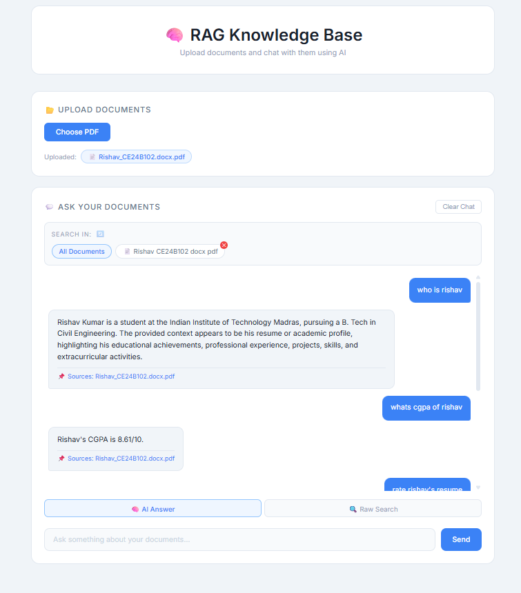

# 🧠 RAG Knowledge Base

An AI-powered document assistant built with Retrieval-Augmented Generation (RAG). Upload your PDFs and chat with them — get accurate answers with source citations, powered by Groq's LLaMA 3.3 70B.

## 🌐 Live Demo
- **App:** https://rag-knowledge-base-three.vercel.app
- **API Docs:** https://rag-knowledge-base-api.onrender.com/docs

> Note: Backend is hosted on Render's free tier and may take 30–60 seconds to wake up on first request.

## ✨ Features

- 📄 Upload multiple PDFs to your knowledge base
- 🔍 Semantic vector search using ChromaDB
- 🧠 LLaMA 3.3 70B via Groq for ultra-fast responses
- 💬 Conversation memory for follow-up questions
- 📌 Source citations on every answer
- 🗂️ Query specific documents or all at once
- 🗑️ Delete documents from the knowledge base

## 🛠️ Tech Stack

| Layer | Technology |
|---|---|
| LLM | Groq (LLaMA 3.3 70B) |
| RAG Framework | LangChain |
| Vector Database | ChromaDB |
| Embeddings | ChromaDB Default (all-MiniLM-L6-v2) |
| Backend | FastAPI (Python) |
| Frontend | React + Vite |
| Deployment | Render + Vercel |

## 📁 Project Structure

```
rag-knowledge-base/
├── backend/
│   ├── main.py                 # FastAPI server & routes
│   ├── rag_pipeline.py         # RAG logic with memory
│   ├── vector_store.py         # ChromaDB operations
│   ├── document_processor.py   # PDF chunking & processing
│   ├── groq_service.py         # Groq LLM setup
│   └── requirements.txt
└── frontend/
    └── src/
        ├── config.js           # API URL config
        ├── App.jsx
        └── components/
            ├── Upload.jsx      # PDF upload component
            └── Chat.jsx        # Chat interface
```

## ⚙️ Run Locally

### Prerequisites
- Python 3.11+
- Node.js 18+
- Groq API key (free at [console.groq.com](https://console.groq.com))

### Backend
```bash
cd backend
pip install -r requirements.txt

# Create .env file
echo "GROQ_API_KEY=your_key_here" > .env

# Start server
uvicorn main:app --reload
```

### Frontend
```bash
cd frontend
npm install

# Create .env.development file
echo "VITE_API_URL=http://localhost:8000" > .env.development

npm run dev
```

Open **http://localhost:5173**

## 🔑 Environment Variables

### Backend (`backend/.env`)
```
GROQ_API_KEY=your_groq_api_key
```

### Frontend (`frontend/.env.development`)
```
VITE_API_URL=http://localhost:8000
```

## 🚀 How It Works

1. **Upload** — PDF is split into chunks and stored as vectors in ChromaDB
2. **Query** — Your question is converted to a vector and matched against stored chunks
3. **Retrieve** — Top 5 most relevant chunks are retrieved
4. **Generate** — Groq's LLaMA 3.3 70B answers using only those chunks
5. **Cite** — Source document is returned alongside the answer

## 📸 Screenshots



## 🔮 Future Improvements

- [ ] URL ingestion (chat with websites)
- [ ] Streaming responses
- [ ] User authentication
- [ ] Support for .txt, .docx files
- [ ] Persistent chat history
